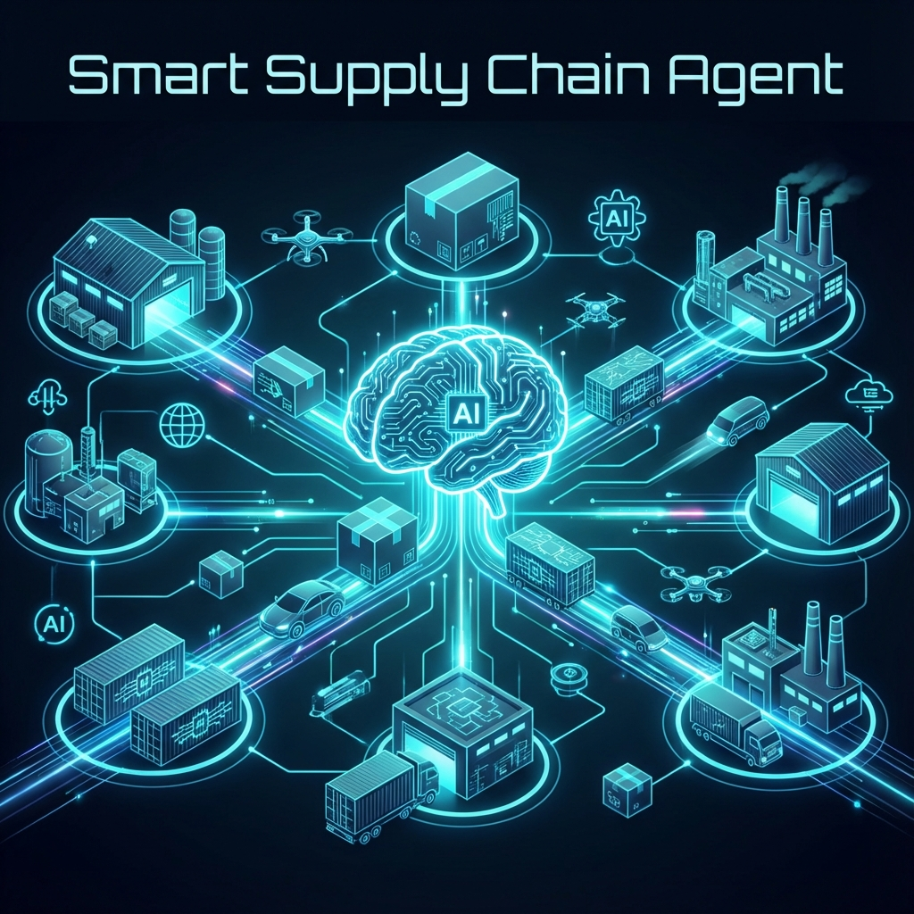
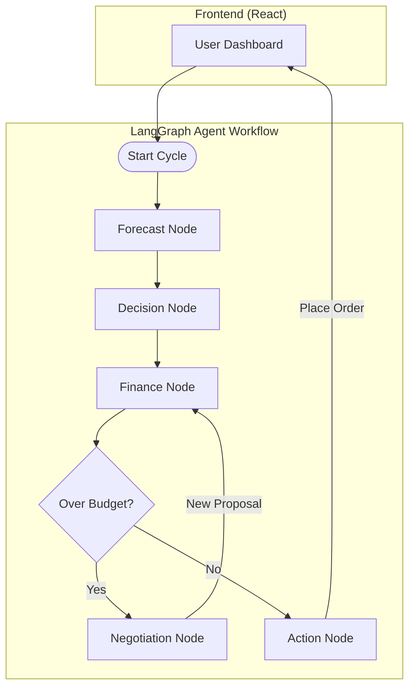

# 🤖 Smart Supply Chain Agent

> **Your AI-Powered Supply Chain Manager**

## 📖 Overview: What does this really do?
**This is not just a chatbot. It is a fully autonomous AI employee that manages your business's supply chain.**

Think of it as hiring a **Digital Supply Chain Manager** who works 24/7. It doesn’t just show you data and wait for you to decide—it **makes decisions itself**.

It automatically:
1.  **🔍 Monitors Inventory**: Watches your warehouse stock levels in real-time.
2.  **📈 Predicts the Future**: Uses AI to forecast exactly what will sell next week.
3.  **💰 Balances the Checkbook**: Ensures you buy the most profitable items without running out of cash.
4.  **🤝 Negotiates**: If "Finance" says an order is too expensive, the Agent doesn't just give up. It **negotiates** a compromise (e.g., *"We really need these items, can we buy a smaller batch for now?"*) to keep business running.

---

## 🌟 Why is this special?
Most software is "dumb"—if you exceed your budget by $1, it gives you an error.

**This Agent is smart.** It simulates a real-world office where a **Purchasing Manager** argues with a **Finance Director**:
*   **The Conflict**: You need $12,000 of stock, but the budget is only $10,000.
*   **The Solution**: Instead of failing, the Agent analyzes the list and proposes: *"Okay, let's drop the slow-selling items and just buy the critical best-sellers to fit the $10k budget."*
*   **The Result**: The order gets placed, the best-sellers stay in stock, and the business keeps running smoothly without a human stepping in.

It combines **Math Logic** (for precise calculations) with **AI Reasoning** (for business strategy).

---

## ⚡ Key Features (Simple View)

### 🧠 1. Smart Forecasting
It adapts to your data.
*   **Stable products**: It uses standard math (Averages) to predict sales.
*   **New/Trendy products**: It uses an LLM (AI) to look at market trends and guess demand even with little data.

### 🛡️ 2. Autonomous Negotiation
As described above, it autonomously resolves budget conflicts using a "Contract Net Protocol". This means it can haggle with its own internal constraints to get the best outcome for the business.

### 💬 3. Talk to Your Data
Stop writing SQL. Just ask:
*   *"What were our top-selling electronics last month?"*
*   *"Which suppliers are late?"*
The agent understands plain English, looks up the data, and gives you the answer.

---
<br>

# 🛠️ Technical Documentation
*(The following section provides deep-dive technical details for engineers and developers)*

---

## 🏗️ Tech Stack & Skills

This project demonstrates a production-grade **Agentic AI** architecture, moving beyond simple RAG or Chatbots.

### **Core AI & Logic**
- **LangGraph**: Used to build the "Brain"—orchestrating multiple agents (Forecast, Finance, Negotiation) in a cyclic workflow.
- **Hybrid Intelligence**: Combines **Linear Programming (PuLP)** for mathematical optimization + **LLMs (Groq/Llama)** for reasoning.
- **RAG (Retrieval Augmented Generation)**: Natural language to SQL generation for analytics.

### **Data & Backend**
- **FastAPI**: High-performance async API.
- **PostgreSQL**: Robust relational database for inventory and sales data.
- **Server-Sent Events (SSE)**: For streaming the agent's "thought process" to the UI in real-time.

### **Frontend**
- **React + TypeScript**: For a clean, modern dashboard.
- **Tailwind CSS**: For responsive styling.

---

## 📐 Architecture Diagram



---

## 🚀 Quick Start Guide

### Prerequisites
- Python 3.10+
- Node.js 18+
- Groq API Key ([Get one here](https://console.groq.com/))

### 1️⃣ Backend Setup
```bash
# Clone
git clone https://github.com/ahmadarif238/Smart-SupplyChain-Agent.git
cd Smart-SupplyChain-Agent

# Venv
python -m venv myenv
source myenv/bin/activate # Windows: myenv\Scripts\activate

# Install
pip install -r requirements.txt

# Config
cp .env.example .env
# Add your GROQ_API_KEY and DATABASE_URL in .env
```

### 2️⃣ Run the App
```bash
# This starts the server and auto-creates the database tables
uvicorn main:app --reload
```

### 3️⃣ Frontend Setup
```bash
cd react-app
npm install
npm run dev
```

Visit `http://localhost:5173` to see the agent in action.

---

## 🔌 Production Readiness
While this is a portfolio project, it is built with production in mind:
*   **Microservices Ready**: Frontend and Backend are decoupled.
*   **Swappable Components**: The "Fetch Data" node can be easily swapped to pull from Shopify, Amazon, or ERPs instead of the demo database.
*   **Dockerized**: Comes with a fuller `docker-compose.yml` for instant deployment.

---

## 📧 Contact
**Arif Ahmad Khan** - [ahmadarif238@gmail.com]
Project Link: [https://github.com/ahmadarif238/Smart-SupplyChain-Agent]

**⭐ Star this repo if you find it useful!**
